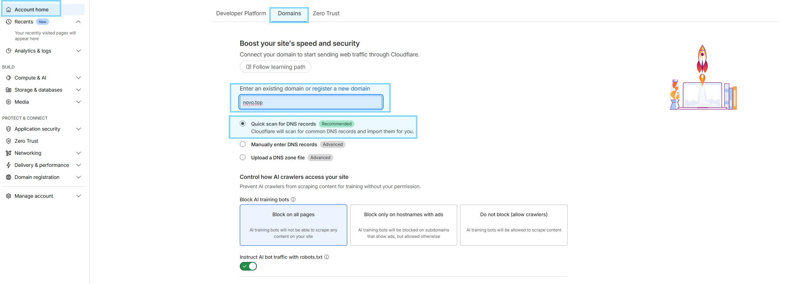
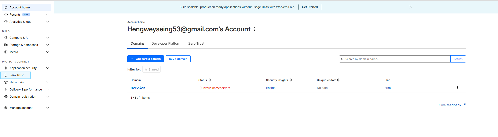
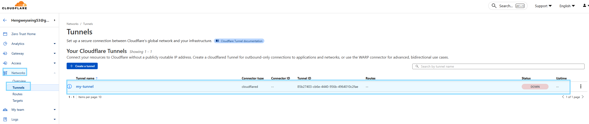

# Setup Guide
- **Install cloudflared**
```bash
# download from Github release
wget -O cloudflared https://github.com/cloudflare/cloudflared/releases/latest/download/cloudflared-linux-amd64
# move to bin
chmod +x cloudflared
sudo mv cloudflared /usr/local/bin/
# check
cloudflared --version
```

- **Start dummy server**
```bash
python3 -m http.server 8000
```

# Quick Cloudflare Tunnel
- **Startup quick tunnel**
```bash
cloudflared tunnel --url http://localhost:<PORT>
```

# WAF-Protected Tunnel
- **Access to Cloudflare via https://dash.cloudflare.com/login**
- **Add domain** by `Free Plan`



- **Create tunnel**
```bash
# login
cloudflared tunnel login
# create
cloudflared tunnel create my-tunnel
# check list
cloudflared tunnel list
```

- **Save credentials filepath**
```bash
Tunnel credentials written to /home/jeremy/.cloudflared/<UUID>.json. cloudflared chose this file based on where your origin certificate was found. Keep this file secret. To revoke these credentials, delete the tunnel.
```

- **Configure tunnel via `~/.cloudflared/config.yml`** 
    - MUST update `credentials-file` below
``` bash
tunnel: my-tunnel
credentials-file: /home/jeremy/.cloudflared/85b27403-cb6e-4440-956b-4964010c2fae.json

ingress:
  - hostname: example.com
    service: http://localhost:8000
  - service: http_status:404
```

- **Startup tunnel**
```bash
cloudflared tunnel run my-tunnel
```

- **Check tunnel**


